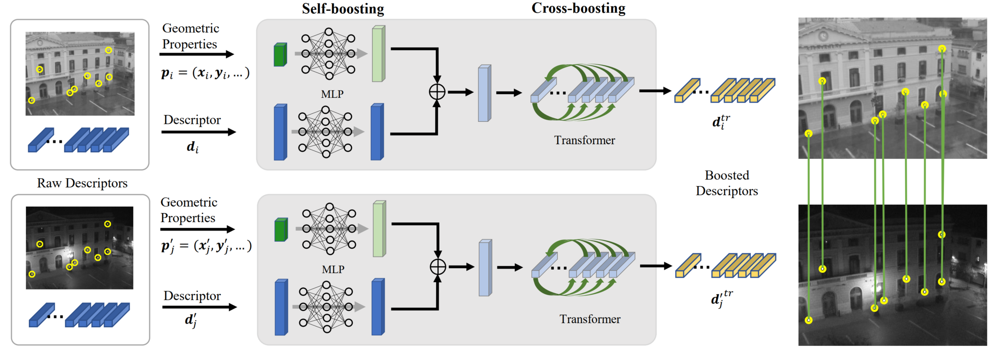

# FeatureBooster Weights File and Demo Script

## Introduction

FeatureBooster is a research project with Midea Corporate Research Center. This repo contains the PyTorch demo code and pretrained weights for FeatureBooster. The FeatureBooster network reuse existing local feature descriptors. It takes the original descriptors and the geometric properties of keypoints as the input, and uses an MLP-based self-boosting stage and a Transformer-based cross-boosting stage to enhance the descriptors. For more details, please see:

* Full paper PDF: [FeatureBooster: Boosting Feature Descriptors with a Lightweight Neural Network](https://arxiv.org/abs/2211.15069)

* Authors: *Xinjiang Wang, Zeyu Liu, Yu Hu, Wei Xi, Wenxian Yu, Danping Zou*

<p align="center">
  
</p>


## Prerequisites

**Step1**: Clone the repository and create a virtual environment
```bash
git clone --recursive https://github.com/SJTU-ViSYS/FeatureBooster.git
cd FeatureBooster/
conda env create -f environment.yml
conda activate featurebooster
```
**Step2**: Install pyCOLMAP for SIFT extractor. Please follow the instruction [here](https://github.com/colmap/pycolmap#building-from-source). 

**Step3**: Build the ORBSLAM2 features
```bash
cd extractors/orbslam2_features/
mkdir build
cd build
cmake -DPYTHON_LIBRARY=~/anaconda3/envs/featurebooster/lib/libpython3.8.so \
      -DPYTHON_INCLUDE_DIR=~/anaconda3/envs/featurebooster/include/python3.8 \
      -DPYTHON_EXECUTABLE=~/anaconda3/envs/featurebooster/bin/python3.8 ..
make -j
```

## Models

The trained weights of FeatureBoosters for different descriptors are provided in `models/`. Boost-F and Boost-B indicate real-valued boosted and binary boosted descriptors, respectively. At present time, the off-the-shelf weights for following feature extractors are provided:
* [ORB](https://github.com/raulmur/ORB_SLAM2) (ORB extractor of ORB-SLAM2)
* [SIFT](https://github.com/colmap/pycolmap) (SIFT extractor of COLMAP)
* [SuperPoint](https://github.com/magicleap/SuperPointPretrainedNetwork)
* [ALIKE](https://github.com/Shiaoming/ALIKE) (ALIKE-L)

## Feature extraction

`extract_features.py` can be used to extract various local features for a given list of images. Currently, the following local features are supported:
* ORB, ORB+Boost-B
* SIFT, SIFT+Boost-F, SIFT+Boost-B
* SuperPoint, SuperPoint+Boost-F, SuperPoint+Boost-B
* ALIKE(-L), ALIKE+Boost-F, ALIKE+Boost-B
* RootSIFT
* SOSNet
* HardNet

*Note: The extraction of SOSNet and HardNet are based on [Kornia](https://github.com/kornia/kornia).*

The output format is [`npz`](https://docs.scipy.org/doc/numpy/reference/generated/numpy.savez.html) and the output feature files contain two arrays: 

- `keypoints` [`N x M`] array contains the positions of keypoints `x, y` and other geometric properties, such as the scales, the detection score, the oriention.
- `descriptors` [`N x D`] array contains the descriptors. For real-valued descriptors, the data type of elements in this array is `np.float32`. For binary descriptor, the type is `np.uint8`.

ORB+Boost-B features for HPatches dataset can be extracted by running:

```bash
python extract_features.py --descriptor ORB+Boost-B --image_list_file image_list_hpatches_sequences.txt
```

## Training

### Dataset Download and Preprocessing

#### 1.MegaDepth

Download the [MegaDepth](http://www.cs.cornell.edu/projects/megadepth/) to your folder `/path/to/megadepth` and preprocess the dataset for training:

```bash
cd datasets/megadepth_utils
python undistort_reconstructions.py --colmap_path /path/to/colmap/executable --base_path /path/to/megadepth
bash preprocess_undistorted_megadepth.sh /path/to/megadepth /path/to/preprocessing/output
```
#### 2.MS COCO（optional）

Download the MS COCO (including [train2014](http://images.cocodataset.org/zips/train2014.zip) and [val2014](http://images.cocodataset.org/zips/val2014.zip)) and extract to your folder `/path/to/ms_cooc`.

### Launching Training

We provide two training scripts. One is for launching the training process with local feature extraction throughout training, and the other one is for launching the training process with pre-extracted local features.

*Note: If the latter training scripts needs to match the training data volume of the former, it demands a lot of storage space. However, the training time for the latter is significantly shorter than the former.*

#### 1.Training while running the local feature extraction

```bash
python train.py --descriptor feature --dataset_path /path/to/megadepth \
       --scene_info_path /path/to/preprocessing/output --config config.yaml
```

*Note: This training scripts currently only supports the MegaDepth dataset. `/path/to/preprocessing/output` is the output folder in [MegaDepth Preprocessing](#1megadepth).*

#### 2.Training with pre-extracted local feature

**Step1**: pre-extracting the local features
```bash
cd datasets/
# for megadepth
python preprocess_datasets.py --descriptor feature --dataset_name megadepth \
       --dataset_path /path/to/megadepth --scene_info_path /path/to/preprocessing/output \
       --data_type type(train or val) --output_path /path/to/output --num_kps 2048
# for coco
python preprocess_datasets.py --descriptor feature --dataset_name coco \
       --dataset_path /path/to/coco --data_type type(train or val) \
       --output_path /path/to/output --num_kps 2048
```
**Step2**: launching the training
```bash
python train_pre.py --descriptor feature --dataset_path /path/to/output --config config.yaml
```

### Training the ***FeatureBooster*** for your own local feature

**Step1**: In `config.yaml`, fill the details of the ***FeatureBooster*** for the local feature in according to the following format:
```yaml
# we recommand use xxx+Boost-F and xxx+Boost-B to represent the float and binary boosted feature of xxx
Name_of_your_boosted_feat: # name likes ORB+Boost-B
    keypoint_dim: # the dimansion of the geomerty propetry 
    keypoint_encoder: # list likes [32, 64, 128, 256]
    descriptor_dim: # the dimansion of the descriptor
    descriptor_encoder: # list likes [512, 256]
    Attentional_layers: # the number of attentional layer
    last_activation: # the type of last activation.
    l2_normalization: # whether to use l2 normalization
    output_dim: # the dimansion of boosted feature
```

**Step2**: In `lib/datatsets.py` and `datasets/preprocess_datasets.py`, add the corresponding feature extraction code in the respective section.

**Step3**: follow the instrction on [Launching Training](#launching-training) and replace the keyword `feature` with your own feature named in `config.yaml`. 

## Evaluation on Hpatches

**Step1**: Download the [HPatches dataset](https://github.com/hpatches/hpatches-dataset) 
```bash
cd hpatches_sequences
bash download.sh
```
**Step2**: Extract the features following the instruction in [Feature extraction](#feature-extraction).

**Step3**: Run the notebook `hpatches_sequences/HPatches-Sequences-Matching-Benchmark.ipynb`. The new methods can be added in cell 4 of the notebook, while the features are supposed to be stored in the [`npz`](https://docs.scipy.org/doc/numpy/reference/generated/numpy.savez.html) format following the description on [Feature extraction](#feature-extraction).

## BibTex Citation

```bibtex
@inproceedings{wang2022featurebooster,
  title={FeatureBooster: Boosting Feature Descriptors with a Lightweight Neural Network},
  author={Wang, Xinjiang and Liu, Zeyu and Hu, yu and Xi, Wei and Yu, Wenxian and Zou, Danping},
  booktitle={Proceedings of the IEEE/CVF Conference on Computer Vision and Pattern Recognition},
  year={2023}
}
```

## Acknowledgement

We borrowed a lot of codes from [D2-Net](https://github.com/mihaidusmanu/d2-net) and [SuperGluePretrainedNetwork](https://github.com/magicleap/SuperGluePretrainedNetwork). Thanks for their excellent works!